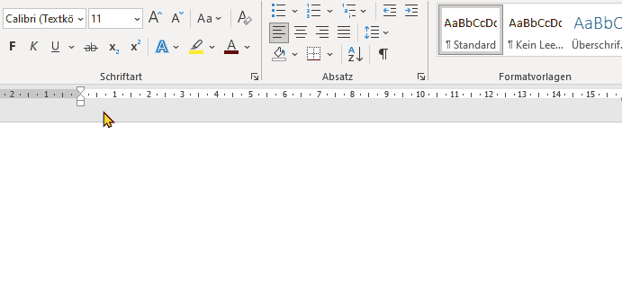
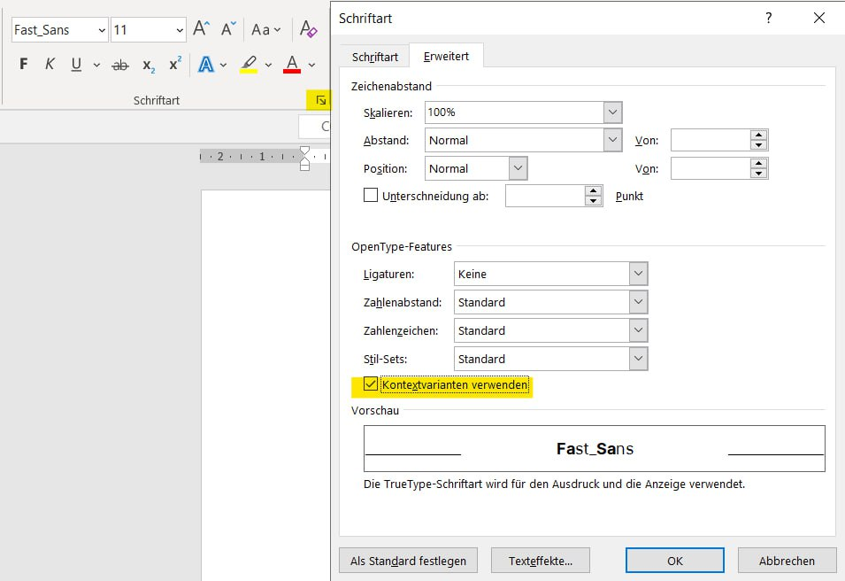
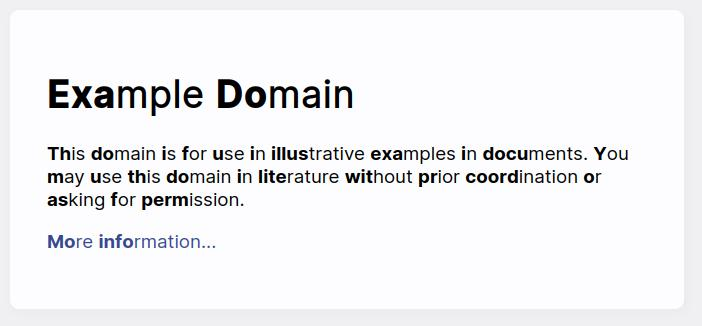

# Fast Font

> **A** **fo**nt **t**o **he**lp **y**ou **re**ad **fas**ter.

This font provides faster reading through facilitating the reading process by guiding the eyes through text with artificial fixation points. As a result, the reader is only focusing on the highlighted initial letters and lets the brain center complete the word. This allows you to read in supersonic speed.



## Demo:

[DEMO](https://Born2Root.github.io/Fast-Font)

## How it works (the technical side):

The basic idea is to substitut the first few letters with their bold variant.

You can define how much should be fixated. A rule of thumb would be something like:

> If there are <= 3 letters, one letter is bold.
>
> If there are == 4 letters, two letters are bold.
>
> If there are > 4 letters, 40% of all letters are bold.

The rules can be applied using OpenType Font features.
Here is a basic example usage of "Contextual Alternates" (calt) substitution:

Having the word "font". OpenType goes through the rules from top to bottom for each letter.

1. The code analyzes the position of the current letter `@az'` inside a word.
1. Starting with "f" only the last `sub` matches as it only ever matches the first letter.
1. On letter "o" the first `sub` matches as there is one previous and two following letters.
1. For the other letters, there are no matching rules.

```fea
feature calt {
    @az = [a-z A-Z];
    @AZ = [a.bold-z.bold A.bold-Z.bold];

    @all = [@az @AZ];

    # 4, 5, 6
    ignore sub @all @all @az' @all @all;
    sub @all @az' @all @all by @AZ;

    # 1, 2, 3
    ignore sub @all @az';
    sub @az' by @AZ;
} calt;
```

### Variation:
You can change the behaviour of the font by changing the code and changing the glyphs.
Possible is for example:

-   Choose your fixation. How much of a word should be bold.
-   Change the opacity of the bold letters.
-   Apply to every font you want.
-   Or use italic instead of bold.

## How to apply the Speed-Reading feature to other Fonts:

Apply the shown feature to any font you like. For example, using the [`addfeatures.py` script](https://github.com/simoncozens/test-fonts/blob/master/addfeatures.py).
If you prefer an WYSIWYG-Editor I can really recommend "[FontLab](https://www.fontlab.com/)", "[FontCreator](https://www.high-logic.com/font-editor/fontcreator)" or "[Font-Forge](https://fontforge.org/)". 

To give you an introduction on how to do this, you can find an elaborate Tutorial for "FontLab 7" here: [Tutorial](https://github.com/Born2Root/Fast-Font/blob/main/README_Tutorial.md)

To use the font in other languages world wide it is necessary to enrich it with the appropriate characters and their substitution.
With about 120 special characters nearly all European languages are covered.
See [opentype_feature.fea](opentype_feature.fea) for an elaborate example.


## How to use the Font:

In Word, enable "Use Contextual Alternates" in the OpenType Features.



You can also use it for programming, i.e. in VSCodium.
Just select your font and set `"editor.fontLigatures": true,`.

Or use it as the default font in your browser:



If you have a Kobo Reader with KoReader-Extension you can also use it there.
Please refer to the [Github Issue](https://github.com/Born2Root/Fast-Font/issues/1) and the  [Corresponding Reddit Post](https://www.reddit.com/r/kobo/comments/186y8m7/speedreading_bionic_font_fast_font_working_on/?rdt=54785)


## Advantages:

-   free
-   offline
-   fast
-   no (additional) client-side code
-   compatible with existing programs
-   privacy respecting


## Support:

The fonts stored in this repository are provided free of charge.
If you like the project, we would appreciate your support.

[](https://www.buymeacoffee.com/born2root)


## Alternatives:

-   https://github.com/ansh/jiffyreader.com
-   https://github.com/ahrm/chrome-fastread
-   https://github.com/boldreader/chrome-extension / https://github.com/akay/firefox-fastread
-   https://boldreader.github.io/boldreader/

## Useful Links:

-   https://blog.readwise.io/bionic-reading-results/
-   https://forum.high-logic.com/viewtopic.php?t=6723
-   https://forum.high-logic.com/viewtopic.php?p=26623#p26623
-   https://sparanoid.com/lab/opentype-features/
-   https://simoncozens.github.io/test-fonts/#fallbackplus-regularotf
-   https://adobe-type-tools.github.io/afdko/OpenTypeFeatureFileSpecification.html#example-3-1
-   https://www.typenetwork.com/news/article/opentype-at-work-contextual-alternates
